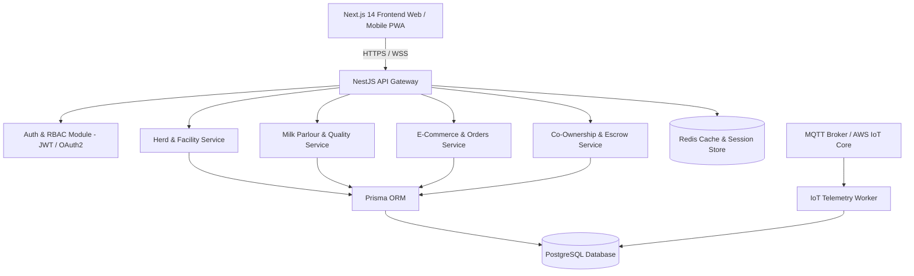

# DairyLift — Known Limitations & Phase 2/3 Roadmap

This document catalogs current prototype limitations in Phase 1 and details the engineering roadmap for Phase 2 (Production Backend) and Phase 3 (Integrations & Security).

---

## 1. Known Limitations in Phase 1

1. **In-Memory State Persistence**:
   - All mutations to cattle records, milking logs, plan versions, and e-commerce orders are stored in memory (`src/lib/services/`).
   - Refreshing the browser or restarting the Next.js server resets state to the default seed datasets.
2. **Mock Authentication**:
   - Authentication is simulated via React Context (`AuthContext.tsx`) with preconfigured personas.
   - No JWT tokens, cookie sessions, or password encryption are active in Phase 1.
3. **Simulated Payments**:
   - E-commerce and co-ownership checkout flows simulate instant authorization without communicating with real banking gateways (Razorpay/Stripe/UPI).
4. **Mock IoT Sensor Telemetry**:
   - Environmental sensor values (temperature, humidity, ammonia) and collar rumination statistics are generated via procedural mock services rather than live hardware telemetry streams.
5. **Illustrative Projections**:
   - Co-ownership yields and APYs are sample simulations. No live investor distributions or escrow payouts occur.

---

## 2. Phase 2: Production Backend & Database Architecture

### Database Planning & Entity Schemas
- **Database Engine**: PostgreSQL 16+ hosted on AWS RDS or Supabase.
- **ORM**: Prisma ORM with strict migrations, automated indexing on `cattleId`, `rfidTag`, and `orderTimestamp`.
- **High-Velocity Tables**:
  - `milking_sessions`: Partitioned by month to support millions of bi-daily records across large-scale farm networks.
  - `sensor_telemetry_timeseries`: Ingested via TimescaleDB extension for microclimate and rumination tracking.
- **Redis Cache Layer**:
  - Store consumer product catalog and pricing for sub-millisecond read latency.
  - Rate limiting for API endpoints.

---

## 3. Phase 3: External Integrations & Security

1. **Payment Gateways & Escrow Ledger**:
   - Integration with RazorpayX / Cashfree for automated escrow distribution disbursements and direct NEFT/UPI payouts to verified investor bank accounts.
   - Payment gateway webhooks with idempotent event handlers.
2. **Hardware IoT Integration**:
   - Direct integration with Afimilk / Nedap ISO cattle collar base stations via MQTT / WebSocket streaming.
   - Real-time automated threshold triggers sending SMS/WhatsApp alerts to duty farm managers.
3. **Regulatory Compliance & Identity (KYC)**:
   - Digital KYC integration (DigiLocker / Aadhaar XML) for co-owner verification.
   - Digital agreement signing via Aadhaar eSign API before plan allocation.
4. **Cold-Chain Logistics API**:
   - Real-time GPS vehicle tracking integration (Fleetx / LocoNav) for refrigerated delivery vans.
